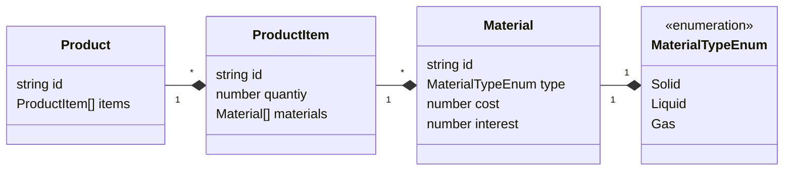

# Code Review

A new full stack developer just arrived in your team. In the context of an e-commerce
application, with a product catalog, they were asked to implement the following feature:

> As a USER I want to update the Cost and Interest of a Material to update a Product's overall price.
>
> When I updated the Cost and Interest
> Then I should see the updated Product's price.

In our context, Products were designed as a list of ProductItem, each of them composed of Materials.
Think of Product as a finished product, composed of multiple sub-parts. Like a car, composed of wheels
composed of rubber tires.

The Product's price is computed as such:

> The Material's Cost times Interest, for each "Solid" or "Liquid"
> Material having a Weight and Dimension, in ProductItems having a quantiy
> greater than 0

This new developer opens a Pull Request, with the code in this repository.
Please provide any feedback that seem relevant to you regarding (but not limited to):
- General coding style
- Best practices

## Back (Nest.js)

- [ ] [product-controller](./back/products/product-controller.ts)
- [ ] [calculate-price](./back/products/calculate-price.ts)
- [ ] [ProductRepository](./back/products/infrastructure/ProductRepository.ts)

## Front (Angular)

- [ ] [product.component.ts](./front/products/product.component.ts)
